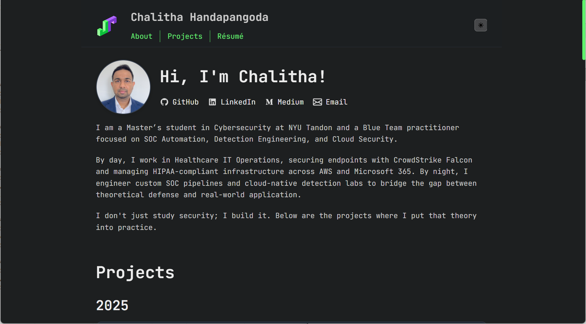

# Portfolio

My personal portfolio website showcasing projects in SOC Automation, Detection Engineering, and Cloud Security.

**Live site:** [chalitha.dev](https://chalitha.dev)

## Preview




## Tech Stack

- Vanilla HTML, CSS, JavaScript
- Markdown content
- GitHub Pages hosting

## Development

```bash
# Serve locally
python -m http.server 8000
```

## Structure

- `index.html` - Main page
- `*.md` - Content (about, projects, resume)
- `styles.css` - Styling
- `script.js` - Functionality

Inspired by [astro-theme-cactus](https://astro-cactus.chriswilliams.dev/) :)
