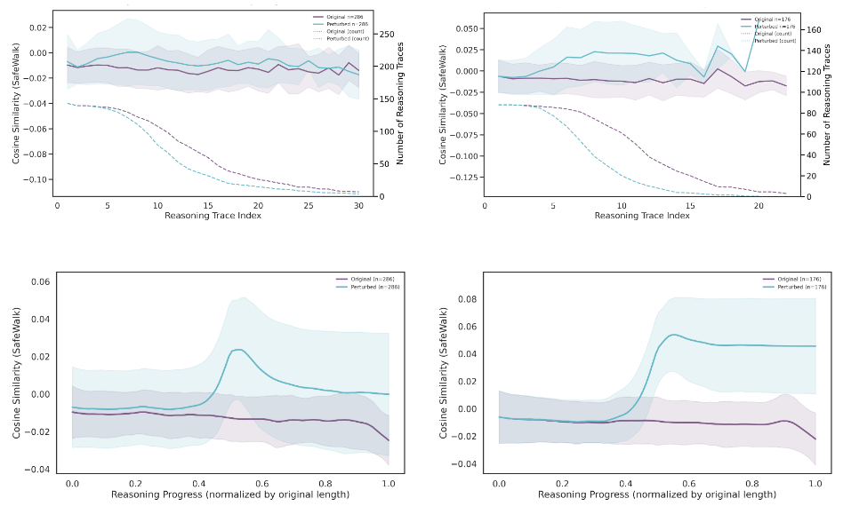

# Projects

## 2025

    

        
    

    

        <h3 class="publication-title">
            <a href="https://github.com/chalithah/SOC-Automation-Lab" class="publication-link">
                End-to-End SOC Automation Project
            </a>
        </h3>
        
SOAR · SIEM · AI Engineering

        
2025

        

            Fully automated, end-to-end SOC pipeline showcasing proficiency in SOAR (n8n), SIEM (Splunk), and AI Engineering. The workflow automates alert detection, enrichment (VirusTotal/AbuseIPDB), LLM triage (OpenAI/Claude MCP), and creates persistent case management tickets in DFIR-IRIS to drastically reduce MTTR.
        

        

            Cybersecurity
            SIEM & SOAR
            <a href="https://github.com/chalithah/SOC-Automation-Lab" class="tag tag-github">GITHUB</a>
        

    

    

        
    

    

        <h3 class="publication-title">
            <a href="/AgentBreeder" class="publication-link">
                AgentBreeder: Mitigating the AI Safety Impact of Multi-Agent Scaffolds via Self-Improvement
            </a>
        </h3>
        
NeurIPS 2025 spotlight

        
J Rosser, Jakob Foerster

        
2025

        

            Multi-Agent Safety
            <a href="https://arxiv.org/abs/2502.00757" class="tag tag-arxiv">ARXIV</a>
            <a href="https://github.com/J-Rosser-UK/AgentBreeder" class="tag tag-github">GITHUB</a>
        

    

    

        
    

    

        <h3 class="publication-title">
            <a href="https://openreview.net/pdf?id=5HGu0ZqBl9" class="publication-link">
                Stream: Scaling Mechanistic Interpretability to Long Context in LLMs via Sparse Attention
            </a>
        </h3>
        
NeurIPS 2025 Mech Interp Workshop

        
J Rosser, José Luis Redondo García, Gustavo Penha, Konstantina Palla, Hugues Bouchard

        
2025

        

            Mechanistic Interpretability
            <a href="https://openreview.net/pdf?id=5HGu0ZqBl9" class="tag tag-arxiv">ARXIV</a>
        

    

    

        
    

    

        <h3 class="publication-title">
            <a href="https://openreview.net/pdf?id=NJNr5KbW3m" class="publication-link">
                Mapping Faithful Reasoning in Language Models
            </a>
        </h3>
        
NeurIPS 2025 Mech Interp Workshop

        
Jiazheng Li, Andreas Damianou, J Rosser, José Luis Redondo García, Konstantina Palla

        
2025

        

            Mechanistic Interpretability
            <a href="https://openreview.net/pdf?id=NJNr5KbW3m" class="tag tag-arxiv">ARXIV</a>
        

    

