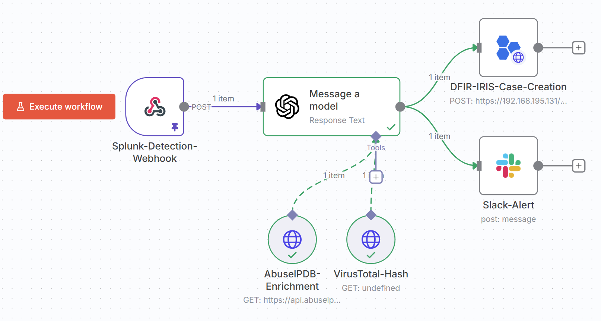
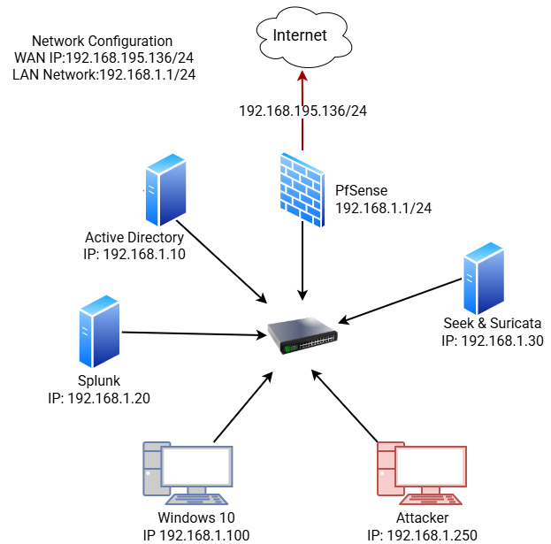
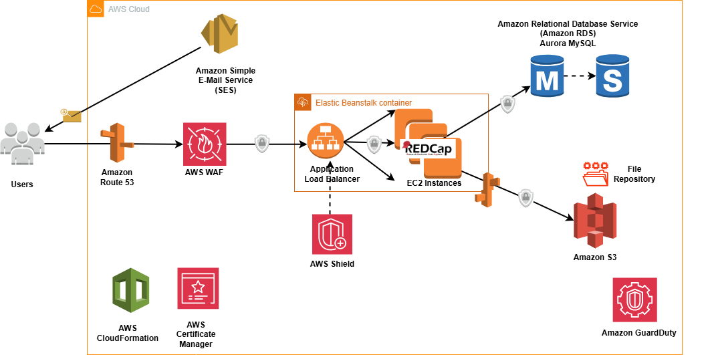
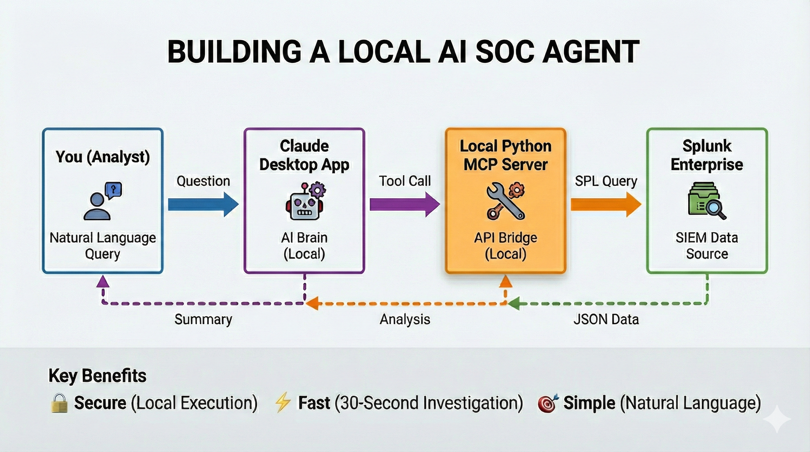
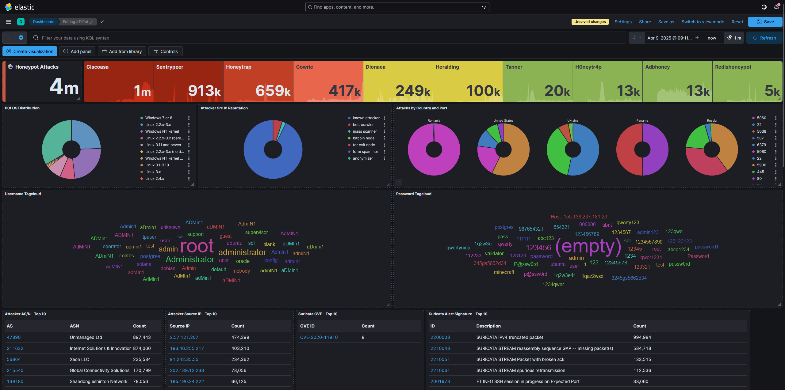

# Projects

## 2025

    

        
    

    

        <h3 class="publication-title">
            <a href="https://github.com/chalithah/SOC-Automation-Lab" class="publication-link">
                End-to-End SOC Automation Project
            </a>
        </h3>
        
SOAR · SIEM · AI Engineering

        
2025

        

            Fully automated, end-to-end SOC pipeline showcasing proficiency in SOAR (n8n), SIEM (Splunk), and AI Engineering. The workflow automates alert detection, enrichment (VirusTotal/AbuseIPDB), LLM triage (OpenAI/Claude MCP), and creates persistent case management tickets in DFIR-IRIS to drastically reduce MTTR.
        

        

            Cybersecurity
            SIEM & SOAR
            <a href="https://github.com/chalithah/SOC-Automation-Lab" class="tag tag-github">GITHUB</a>
        

    

    

        
    

    

        <h3 class="publication-title">
            <a href="https://github.com/chalithah/detection-engineering-lab" class="publication-link">
                Enterprise Detection & Adversary Emulation Lab
            </a>
        </h3>
        
Splunk · Zeek · Suricata · MITRE ATT&CK

        
2025

        

            Built a complete SOC infrastructure to simulate and detect real-world adversary tradecraft. I engineered a segmented network with Active Directory and pfSense, then executed attacks (C2 Beaconing, Persistence, Recon) mapped to the MITRE ATT&CK framework.
Outcome: Developed high-fidelity Splunk detections by correlating Sysmon endpoint telemetry with Zeek/Suricata network data, proving the ability to detect threats that bypass standard logging.
        

        

            Detection Engineering
            Threat Hunting
            <a href="https://github.com/chalithah/detection-engineering-lab" class="tag tag-github">GITHUB</a>
        

    

    

        
    

    

        <h3 class="publication-title">
            <a href="https://github.com/chalithah/Securing-REDCap-OWASP-AWS-WAF" class="publication-link">
                Cloud Defense: Mitigating Live DDoS Attacks
            </a>
        </h3>
        
AWS WAF · AWS Shield · Fortinet Managed Rules

        
2024

        

            Real-world incident response: Secured REDCap web application on AWS under active DDoS attack. Implemented AWS WAF with Fortinet Managed Rules to block OWASP Top 10 exploits (SQLi, XSS), stabilized HTTP 4xx error rates, and reduced malicious traffic. Integrated AWS Shield for volumetric attack mitigation and GuardDuty for continuous threat monitoring.
        

        

            Cloud Security
            DDoS Mitigation
            <a href="https://github.com/chalithah/Securing-REDCap-OWASP-AWS-WAF" class="tag tag-github">GITHUB</a>
        

    

    

        
    

    

        <h3 class="publication-title">
            <a href="https://github.com/chalithah/splunk-claude-mcp-agent" class="publication-link">
                AI Security Analyst: Splunk & Claude Integration
            </a>
        </h3>
        
Python · Anthropic API · Splunk SDK · MCP

        
2025

        

            Engineered a local Model Context Protocol (MCP) server bridging Claude AI with Splunk Enterprise for natural language threat hunting. The agent writes SPL queries, executes searches, and analyzes results without uploading sensitive data to the cloud. Successfully identified credential dumping attacks (Mimikatz/T1003) and Windows Defender evasion techniques through conversational AI interaction.
        

        

            AI Engineering
            Security Automation
            <a href="https://github.com/chalithah/splunk-claude-mcp-agent" class="tag tag-github">GITHUB</a>
        

    

    

        
    

    

        <h3 class="publication-title">
            <a href="https://github.com/chalithah/T-Pot-Honeypot-Cloud-Deployment" class="publication-link">
                Cloud Threat Intel: T-Pot Honeypot Analysis
            </a>
        </h3>
        
T-Pot · Elastic Stack (ELK) · Kibana

        
2024

        

            Deployed high-interaction honeypot on Vultr cloud to capture 4+ million real-world cyberattacks over 30 days. Analyzed global threat patterns using Elastic Stack, identifying credential stuffing campaigns, C2 callbacks, and exploit attempts targeting SSH/FTP/HTTP. Documented top attacker ASNs, common credentials, and malicious payloads for threat intelligence enrichment.
        

        

            Threat Intelligence
            Big Data Analysis
            <a href="https://github.com/chalithah/T-Pot-Honeypot-Cloud-Deployment" class="tag tag-github">GITHUB</a>
        

    

